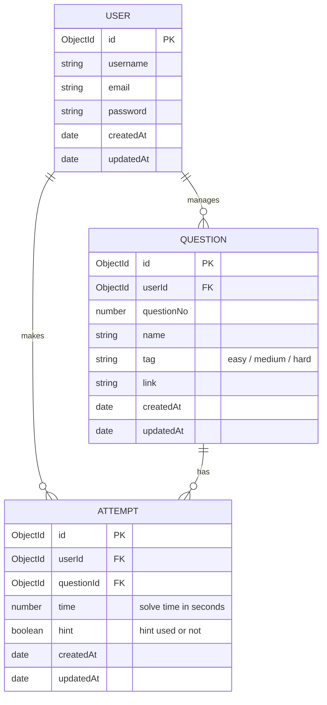

<p align="center">
  
</p>

<h1 align="center">Recur</h1>

<p align="center">
  <strong>A premium, interactive Spaced Repetition & Data Structures and Algorithms (DSA) Practice Tracker.</strong>
</p>

<p align="center">
  
  
  
  
  
  
</p>

---

## 📊 Dashboard Preview

<p align="center">
  
</p>

---

## ✨ Features

- **📊 Comprehensive Stats Dashboard**: Tracks solved questions grouped by difficulty (Easy, Medium, Hard), showcases distribution dynamically using interactive Pie Charts, and calculates exact average solving duration.
- **⏱️ Integrated Practice Stopwatch**: An in-browser stepper flow equipped with a live stopwatch to measure the precise time spent on each question attempt.
- **📅 Practice & Review History**: Retain complete logs of all past attempts, including solution notes, hint usage, external problem links, and time tags.
- **🔐 Secure Session Authentication**: Uses `httpOnly`, cross-site secure cookie verification for production environments, keeping user sessions safe against CSRF and credential theft.
- **🛡️ Production Ready & Robust**: Features password strength rules (8+ chars), strict input validations to combat Stored XSS vulnerabilities, and an API rate limiter to protect against brute-force attacks.

---

## 🛠️ Tech Stack

### Frontend
* **Framework**: React 19 + Vite 8 (TypeScript)
* **Styling**: Tailwind CSS v4.0
* **Animations**: Motion (Framer Motion) & custom micro-interactions
* **Charts**: Material UI X-Charts (`@mui/x-charts`)
* **Icons**: Lucide React
* **State & Fetching**: Axios with custom interceptors for session sync

### Backend & Database
* **Framework**: Node.js & Express v5.2
* **Database**: MongoDB via Mongoose v9.7
* **Session Management**: JWT + Cookie Parser (`httpOnly` cookies)
* **Security**: Helmet, CORS origin controls, custom validators, and Express Rate Limit (50 reqs / 15 mins)

---

## 📐 Database Schema & Architecture

The database is built on a clean relational mapping in MongoDB:



---

## 🔌 API Reference

### 🔐 Authentication (`/api/auth`)
* `POST /api/auth/signup` - Register a new user (Enforces email structure & 8+ character password)
* `POST /api/auth/login` - Login user and issue secure JWT cookie
* `POST /api/auth/logout` - Clear user session cookies
* `GET /api/auth/me` - Retrieve current logged-in user profile (token verification)

### 📊 Dashboard & Stats (`/api/dashboard`) (All endpoints protected by authentication middleware)
* `POST /api/dashboard/attempt` - Log a new question solving attempt
* `GET /api/dashboard/question` - Retrieve all solved questions for the user
* `GET /api/dashboard/question/:id` - Retrieve single question attempt history
* `GET /api/dashboard/stats` - Get aggregated counts, durations, and charts data

---

## 🚀 Local Development Setup

Follow these steps to run the Recur application locally:

### Prerequisites
* Node.js (v18+ recommended)
* MongoDB (Local instance or MongoDB Atlas Connection string)

### 1. Server Configuration & Setup
1. Navigate to the server folder:
   ```bash
   cd server
   ```
2. Install backend dependencies:
   ```bash
   npm install
   ```
3. Create a `.env` file in the `server` directory and add the following variables:
   ```env
   PORT=3000
   MONGO_URI=your_mongodb_connection_string
   JWT_SECRET=your_jwt_secret_key
   CLIENT_URL=http://localhost:5173
   NODE_ENV=development
   ```
4. Start the server in development mode:
   ```bash
   npm run dev
   ```
   The API server will run on `http://localhost:3000`.

---

### 2. Client Configuration & Setup
1. Navigate to the client folder:
   ```bash
   cd client
   ```
2. Install frontend dependencies:
   ```bash
   npm install
   ```
3. Create a `.env` file in the `client` directory:
   ```env
   VITE_API_BASE_URL=http://localhost:3000
   ```
4. Start the Vite development server:
   ```bash
   npm run dev
   ```
   Open `http://localhost:5173` in your browser.

---

## 🔒 Security & Quality Assurance

Recur has been thoroughly audited and is certified with a **🟢 GREEN CARD** for production release. The following safeguards are fully integrated:
1. **Input Validation**: Strict schema-level regex check on emails and minimum 8-character passwords on both frontend and backend.
2. **XSS Protection**: Neutralizes stored cross-site scripting (XSS) vectors by validating links and stripping protocol headers.
3. **Session Cookies**: Implements `httpOnly`, cross-site secure cookie verification for production environments to mitigate CSRF and session hijacking.
4. **Rate Limiting**: Configured with a stable production rate limit of **50 requests per 15 minutes** per IP.
5. **IDOR Mitigation**: Attempt queries are strictly user-scoped via security checks, preventing unauthorized records access.
